# System Architecture (Automated)

> **Last Updated**: HEAD
> **Rationale**: Automated synthesis of system evolution based on commit intent.

## Visual Overview

```mermaid
C4Context
    title Architecture Overview
    Boundary(b_OrderService, "OrderService", "class_definition") {
        System(OrderService, "OrderService", "class_definition")
        System(create_order, "create_order", "function_definition")
        System(cancel_order, "cancel_order", "function_definition")
    }
    UpdateElementStyle(OrderService, $bgColor="#d4edda", $borderColor="#28a745")
    Boundary(b_AnalysisRequest, "AnalysisRequest", "class_definition") {
        System(AnalysisRequest, "AnalysisRequest", "class_definition")
    }
    UpdateElementStyle(AnalysisRequest, $bgColor="#d4edda", $borderColor="#28a745")
    Boundary(b_analyze_commit, "analyze_commit", "function_definition") {
        System(analyze_commit, "analyze_commit", "function_definition")
    }
    UpdateElementStyle(analyze_commit, $bgColor="#d4edda", $borderColor="#28a745")
    Boundary(b_perform_analysis, "perform_analysis", "function_definition") {
        System(perform_analysis, "perform_analysis", "function_definition")
    }
    UpdateElementStyle(perform_analysis, $bgColor="#d4edda", $borderColor="#28a745")
    Boundary(b_cli_trigger, "cli_trigger", "function_definition") {
        System(cli_trigger, "cli_trigger", "function_definition")
    }
    UpdateElementStyle(cli_trigger, $bgColor="#d4edda", $borderColor="#28a745")
    Boundary(b_AgentState, "AgentState", "class_definition") {
        System(AgentState, "AgentState", "class_definition")
    }
    UpdateElementStyle(AgentState, $bgColor="#d4edda", $borderColor="#28a745")
    Boundary(b_architect_agent, "architect_agent", "function_definition") {
        System(architect_agent, "architect_agent", "function_definition")
    }
    UpdateElementStyle(architect_agent, $bgColor="#d4edda", $borderColor="#28a745")
    Boundary(b_security_agent, "security_agent", "function_definition") {
        System(security_agent, "security_agent", "function_definition")
    }
    UpdateElementStyle(security_agent, $bgColor="#d4edda", $borderColor="#28a745")
    Boundary(b_synthesis_agent, "synthesis_agent", "function_definition") {
        System(synthesis_agent, "synthesis_agent", "function_definition")
    }
    UpdateElementStyle(synthesis_agent, $bgColor="#d4edda", $borderColor="#28a745")
    Boundary(b_create_council_graph, "create_council_graph", "function_definition") {
        System(create_council_graph, "create_council_graph", "function_definition")
    }
    UpdateElementStyle(create_council_graph, $bgColor="#d4edda", $borderColor="#28a745")
    Boundary(b_StructuralChange, "StructuralChange", "class_definition") {
        System(StructuralChange, "StructuralChange", "class_definition")
    }
    UpdateElementStyle(StructuralChange, $bgColor="#d4edda", $borderColor="#28a745")
    Boundary(b_SecurityRisk, "SecurityRisk", "class_definition") {
        System(SecurityRisk, "SecurityRisk", "class_definition")
    }
    UpdateElementStyle(SecurityRisk, $bgColor="#d4edda", $borderColor="#28a745")
    Boundary(b_IntentObject, "IntentObject", "class_definition") {
        System(IntentObject, "IntentObject", "class_definition")
    }
    UpdateElementStyle(IntentObject, $bgColor="#d4edda", $borderColor="#28a745")
    Boundary(b_BrowserAction, "BrowserAction", "class_definition") {
        System(BrowserAction, "BrowserAction", "class_definition")
    }
    UpdateElementStyle(BrowserAction, $bgColor="#d4edda", $borderColor="#28a745")
    Boundary(b_WalkthroughSeed, "WalkthroughSeed", "class_definition") {
        System(WalkthroughSeed, "WalkthroughSeed", "class_definition")
    }
    UpdateElementStyle(WalkthroughSeed, $bgColor="#d4edda", $borderColor="#28a745")
    Boundary(b_WalkthroughSeeder, "WalkthroughSeeder", "class_definition") {
        System(WalkthroughSeeder, "WalkthroughSeeder", "class_definition")
        System(generate_seed, "generate_seed", "function_definition")
    }
    UpdateElementStyle(WalkthroughSeeder, $bgColor="#d4edda", $borderColor="#28a745")
    Boundary(b_IntentParser, "IntentParser", "class_definition") {
        System(IntentParser, "IntentParser", "class_definition")
        System(__init__, "__init__", "function_definition")
        System(parse_content, "parse_content", "function_definition")
        System(extract_structure, "extract_structure", "function_definition")
    }
    UpdateElementStyle(IntentParser, $bgColor="#d4edda", $borderColor="#28a745")
    Boundary(b_ArchitectureSynthesizer, "ArchitectureSynthesizer", "class_definition") {
        System(ArchitectureSynthesizer, "ArchitectureSynthesizer", "class_definition")
        System(__init__, "__init__", "function_definition")
        System(_load_state, "_load_state", "function_definition")
        System(_save_state, "_save_state", "function_definition")
        System(generate_mermaid, "generate_mermaid", "function_definition")
        System(update_documentation, "update_documentation", "function_definition")
    }
    UpdateElementStyle(ArchitectureSynthesizer, $bgColor="#d4edda", $borderColor="#28a745")
```

## Semantic Changelog

### Changes in this Commit
- **OrderService** (class_definition): New class_definition implementation detected.
- **create_order** (function_definition): New function_definition implementation detected.
- **cancel_order** (function_definition): New function_definition implementation detected.
- **AnalysisRequest** (class_definition): New class_definition implementation detected.
- **analyze_commit** (function_definition): New function_definition implementation detected.
- **perform_analysis** (function_definition): New function_definition implementation detected.
- **cli_trigger** (function_definition): New function_definition implementation detected.
- **AgentState** (class_definition): New class_definition implementation detected.
- **architect_agent** (function_definition): New function_definition implementation detected.
- **security_agent** (function_definition): New function_definition implementation detected.
- **synthesis_agent** (function_definition): New function_definition implementation detected.
- **create_council_graph** (function_definition): New function_definition implementation detected.
- **StructuralChange** (class_definition): New class_definition implementation detected.
- **SecurityRisk** (class_definition): New class_definition implementation detected.
- **IntentObject** (class_definition): New class_definition implementation detected.
- **BrowserAction** (class_definition): New class_definition implementation detected.
- **WalkthroughSeed** (class_definition): New class_definition implementation detected.
- **WalkthroughSeeder** (class_definition): New class_definition implementation detected.
- **generate_seed** (function_definition): New function_definition implementation detected.
- **IntentParser** (class_definition): New class_definition implementation detected.
- **__init__** (function_definition): New function_definition implementation detected.
- **parse_content** (function_definition): New function_definition implementation detected.
- **extract_structure** (function_definition): New function_definition implementation detected.
- **walk** (function_definition): New function_definition implementation detected.
- **ArchitectureSynthesizer** (class_definition): New class_definition implementation detected.
- **__init__** (function_definition): New function_definition implementation detected.
- **_load_state** (function_definition): New function_definition implementation detected.
- **_save_state** (function_definition): New function_definition implementation detected.
- **generate_mermaid** (function_definition): New function_definition implementation detected.
- **update_documentation** (function_definition): New function_definition implementation detected.
