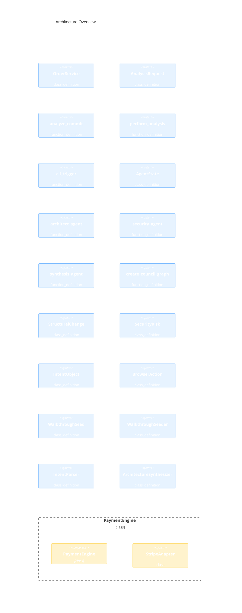

# System Architecture (Automated)
        
> [!NOTE]
> This document is automatically generated from commit intent. **Zero manual updates required.**

### **Visual Legend**
- ■ **Added**: New architectural component in this commit.
- ■ **Modified**: Existing component with logic/structural changes.
- ■ **Persistent**: Unchanged component from previous baseline.

---

## Visual Overview

## Semantic Changelog

> **Commit**: `feat-payment-engine`
> **Rationale**: Implementing a robust Payment Engine with C4 mapping.

### Changes in this Commit

#### Component Layer
- **PaymentEngine** (class) `#service`: New core service for transaction orchestration.

#### Code Layer
- **StripeAdapter** (class) : Third-party payment gateway integration.

## 🛡️ Security Insights
- **[High]**: Hardcoded test key in StripeAdapter  
  *Recommendation*: Use env variables.
