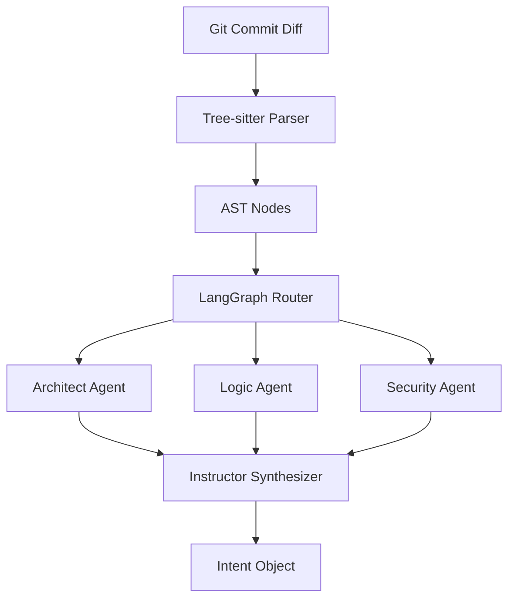

# Technical Plan: Phase 2 - Agentic Intent Extraction Engine

## **1. Architecture Overview**

## **2. Steps**

### **Step 1: Tree-sitter Integration (T.2.1)**
*   Install `tree-sitter` and language grammars.
*   Create `src/engine/parser.py` to handle AST extraction.
*   Implement a normalization layer to map language-specific nodes to a universal "Component" model.

### **Step 2: LangGraph Orchestration (T.2.2 - T.2.4)**
*   Define the state machine for the Council of Agents.
*   Implement agent prompts and tools for architectural analysis.
*   Set up the feedback loop between agents for cross-validation.

### **Step 3: Structured Extraction (T.2.5)**
*   Define Pydantic models for the "Intent Object".
*   Implement the LLM synthesis layer using **Instructor**.

## **3. Verification**
*   Create a test commit with a new class/function and verify the extracted "Intent Object" correctly identifies the structural change.
