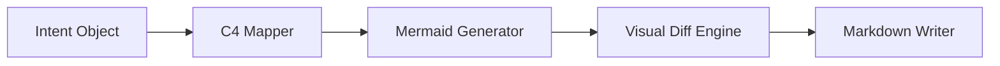

# Technical Plan: Phase 3 - Generative Synthesis & Visual Diffing

## **1. Synthesis Pipeline**

## **2. Steps**

### **Step 1: Mermaid C4 Generator (T.3.1)**
*   Create `src/engine/synthesis.py`.
*   Implement a class `MermaidGenerator` that takes an `IntentObject` and produces Mermaid C4 syntax.
*   Focus on `C4Context` and `C4Container` templates.

### **Step 2: Visual Diff Engine (T.3.2)**
*   Implement state persistence for the "Global Architecture Map".
*   Create a diffing logic that compares the new `IntentObject` against the persistent state.
*   Apply Mermaid `classDef` or `style` tags to nodes to represent their change status (New/Modified/Deleted).

### **Step 3: Automated Documentation (T.3.3)**
*   Create a template for `/docs/architecture.md`.
*   Implement the writer logic that embeds the generated Mermaid code and the semantic changog.

## **3. Verification**
*   Run the orchestrator and verify that `docs/architecture.md` is created/updated with a valid Mermaid diagram showing the new components.
