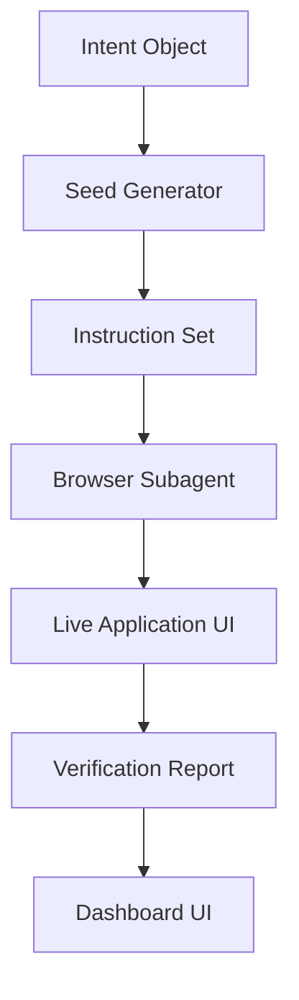

# Technical Plan: Phase 5 - Agentic Feedback & Walkthroughs

## **1. Agentic Validation Pipeline**

## **2. Steps**

### **Step 1: Seed Generator (T.5.1)**
*   Create `src/engine/agent_seeding.py`.
*   Implement `WalkthroughSeeder` to map `StructuralChange` and `LogicAgent` insights into a series of `BrowserAction` nodes.

### **Step 2: Browser Agent Interface (T.5.2)**
*   Define a standard API for the orchestrator to communicate with the Browser Subagent.
*   Implement a "Test Mode" where the agent performs a dry-run of the synthesized workflow.

### **Step 3: Scaling & Hardening (T.5.3)**
*   Integrate **Temporal** for long-running agentic sessions.
*   Implement world-class error handling and recovery for failed walkthroughs.

## **3. Verification**
*   Trigger a "Walkthrough Request" for the `PaymentService` and verify that an instruction set is generated that covers the "Login -> Checkout -> Pay" flow.
