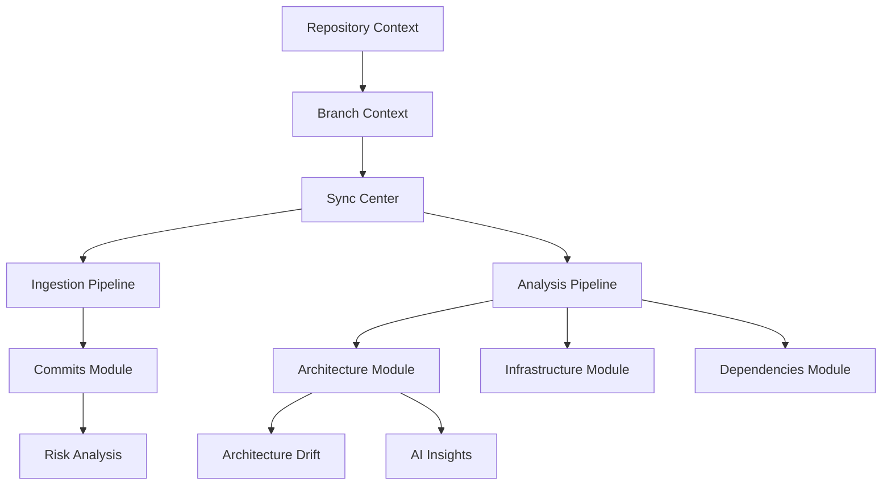

# GitPulse System Audit & Root Cause Analysis

## 1. Subsystem Audit Overview

| Module | Status | Backend Route | Data Source | Issues Identified |
| :--- | :--- | :--- | :--- | :--- |
| **Overview** | ⚠️ Partial | `/overview` | DB + Aggregation | Hardcoded velocity charts, missing some metrics. |
| **Branches** | 🔴 Placeholder | `/branches` | DB | Frontend is a complete placeholder. |
| **Architecture**| ⚠️ Partial | `/architecture` | DB (Snapshots) | Metrics (Coupling/Integrity) are lost during save. |
| **Drift** | ⚠️ Partial | `/drift` | DB (Diff) | Basic node filtering; no edge or data drift logic. |
| **Commits** | ⚠️ Partial | `/commits` | DB | Missing AI synthesis (Intent, Risk, Impact). |
| **Infra** | 🔴 Broken | *Missing* | *Missing* | Frontend 404s; backend route not implemented. |
| **Dependencies**| 🔴 Broken | *Missing* | *Missing* | Frontend 404s; backend route not implemented. |
| **Services** | 🔴 Placeholder | *Missing* | *Missing* | Frontend is a complete placeholder. |
| **Sync Center** | ⚠️ Partial | `/sync-jobs` | DB | Polling-based; no real-time stream integration. |
| **Insights** | 🔴 Stub | `/insights` | DB (Stub) | Returns generic "Architecture detected" stubs. |
| **Risk** | 🔴 Stub | `/risk` | DB (Stub) | Returns static `{ risks: [], overallRisk: 'LOW' }`. |

## 2. Root Cause Analysis

### A. State Inconsistency & Race Conditions
The dashboard frequently crashes or 404s during initial load because child components initialize before the `RepositoryContext` (repoId/branch) is resolved. The `_` placeholder is often sent to the backend.
*   **Fix**: Global `WorkspaceGuard` (Already partially implemented, needs enforcement).

### B. Pipeline Data Loss
The `ArchitectureAgent` generates high-fidelity metrics, but the `ArchitecturePipeline` only persists the `topology` and `summary`.
*   **Fix**: Update `ArchitectureSnapshot` schema and pipeline to store `metrics` Json.

### C. Missing Intelligence Loop
Commits are fetched from GitHub but never passed to an analysis agent. This leaves `intentSummary`, `riskScore`, and `archImpactScore` as `null` in the database.
*   **Fix**: Implement `AnalystAgent` and integrate into `CommitIngestionPipeline`.

### D. Disconnected Modules
Infrastructure and Dependency scanning logic exists in agents/pipelines but no API routes expose this data to the frontend.
*   **Fix**: Create `/api/repositories/:id/infrastructure` and `/api/repositories/:id/dependencies` routes.

## 3. Subsystem Dependency Map

## 4. Broken Pipeline Report

1.  **Sync Pipeline**: Currently triggers but doesn't handle failures or retries gracefully.
2.  **Commit Ingestion**: Stops at "Store in DB". Missing "Analyze for Intent/Risk".
3.  **Architecture Pipeline**: Discards metrics.
4.  **Infrastructure Pipeline**: Result is never exposed via API.
5.  **Dependency Pipeline**: Result is never exposed via API.
