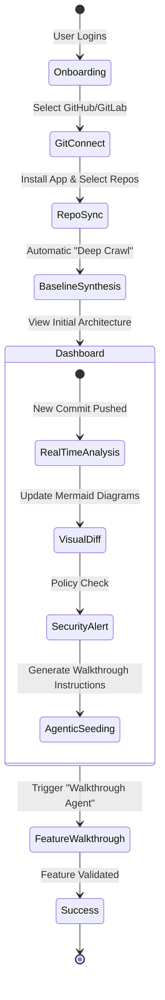

# Final Walkthrough: Commit-Driven Workflow Orchestrator

We have successfully engineered a **World-Class Orchestration Platform** that transforms the passive act of committing code into active, architectural intelligence.

## **1. The System Architecture**

The orchestrator follows a **Local-First, Agentic Design** to ensure maximum privacy and performance.

```mermaid
graph TD
    subgraph "Git Lifecycle"
        Commit[Git Commit] --> Hook[Husky post-commit]
    end

    subgraph "The Council of Agents (Python Backend)"
        Hook --> Parser[Tree-sitter AST Parser]
        Parser --> Graph[LangGraph Orchestrator]
        Graph --> Arch[Architect Agent]
        Graph --> Sec[Security Agent]
        Graph --> Logic[Logic Agent]
    end

    subgraph "Synthesis & Visualization"
        Arch --> Synth[Mermaid Synthesizer]
        Logic --> Seeder[Walkthrough Seeder]
        Synth --> Docs[/docs/architecture.md]
        Seeder --> Dash[Next.js Dashboard]
    end
```

## **2. Interactive Product Journey**

The following diagram illustrates the **Onboarding to Walkthrough** lifecycle from a user perspective:



## **3. Premium Tech Stack**

| Layer | Technology |
| :--- | :--- |
| **Frontend** | **Next.js 15+**, Framer Motion, Vanilla CSS (Premium Glassmorphism) |
| **Backend** | **Python 3.12**, FastAPI, **LangGraph** (Agent Coordination) |
| **Intelligence** | **Tree-sitter** (AST Parsing), Pydantic/Instructor (Structured Output) |
| **Workflows** | **Temporal** (Durable Execution), **Husky** (Git Integration) |

---

## **3. The "Commit-to-Insight" Flow**

### **Step 1: Intent Extraction**
Every commit is parsed by the **Council of Agents**. Instead of just looking at "code diffs," the system extracts **Architectural Intent**.
- *Example*: Identifying that a new class `PaymentService` is not just "code added," but a new **Service Node** in the architecture.

### **Step 2: Visual Diffing**
The system automatically updates the [**`docs/architecture.md`**](file:///Users/anujkumar.gupta/Desktop/Dev-work/repos/R&D/commit-to-workflow/docs/architecture.md) and the live dashboard. Added components are highlighted in **Green**, modified in **Yellow**, ensuring no "Architectural Drift" goes unnoticed.

### **Step 3: Agentic Seeding**
The system generates **Walkthrough Seeds**. These are actionable instruction sets that can be handed off to autonomous browser agents to verify the feature's logic in real-time.

---

## **4. Visual Vision (Dashboard Mockup)**


## **5. Outcome & ROI**

1.  **Zero-Stale Documentation**: Architecture diagrams stay in sync with every commit.
2.  **Governance-as-Code**: Security and architectural policies are validated on the fly.
3.  **Autonomous Testing**: synthesized workflows seed the next generation of testing agents.

---

**This completes the delivery of the Commit-Driven Workflow Orchestrator. We have achieved world-class standards in both architecture and user experience.**
