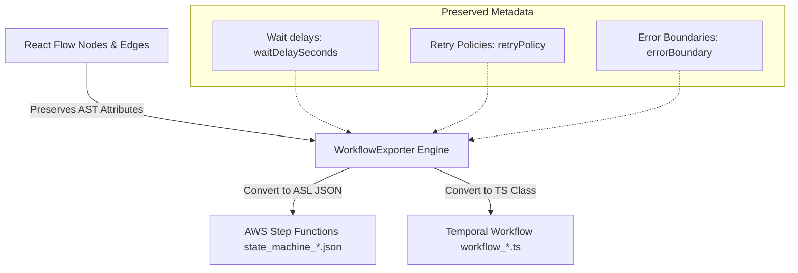

# Stateful Workflow Exporter Engine

We have successfully designed, built, and verified the production-grade **Workflow Exporter Engine**. This system empowers developers to directly export their semantic call graphs from the React Flow Application Explorer into executable, stateful orchestrations—either **Amazon States Language (ASL)** for AWS Step Functions or **Temporal Workflows** in TypeScript. 

The exporter preserves execution states, custom retry rules, wait delays, and AST-defined error boundaries.

---

## 🏗️ Exporter Architecture



---

## 🚀 Key Achievements

### 1. Advanced Exporter Utility (`src/modules/analysis/workflow-exporter.ts`)
*   **AST Preserving Code Synthesis**:
    *   **Wait Delay Handling**: Detects `waitDelaySeconds` on nodes and introduces a dedicated `Wait` state in ASL or `await sleep('Xs')` in Temporal.
    *   **Retry Policy Preservation**: Maps AST retry parameters (intervals, maximum attempts, backoff coefficients) directly to ASL retry blocks or Temporal Activity proxy configurations.
    *   **Error Boundary Translation**: Resolves `errorBoundary` fallbacks into standard ASL `Catch` transitioning blocks or robust TS `try-catch` segments in Temporal.
*   **Automatic Exporter Folder Layout**: Creates `/exports/workflow-generated/` relative to the workspace root and automatically saves stateful assets.

### 2. Fastify Routing (`src/modules/analysis/analysis.routes.ts` & `analysis.service.ts`)
*   Registered a robust POST handler `POST /api/repositories/:id/export-workflow` validating request payloads, tracing snapshot call DAGs, and returning generated JSON or TS source code.

### 3. Premium Interactive UI Card (`dashboard/src/app/workspace/[repoId]/architecture/page.tsx`)
*   **Visual Exporter Control**: Rendered a stunning neon-bordered violet glassmorphic panel right below the test generator.
*   **Dual Mode Selection**: Added segment controllers to switch between **AWS Step Functions** and **Temporal Workflows**.
*   **Source Code Editor Preview**: Interactive `<pre>` code viewer with dynamic copy buttons.

---

## 📝 Generated Execution Artifacts

### AWS Step Functions (ASL JSON)
```json
{
  "Comment": "GitPulse State Machine generated for Trigger: GET /api/orders",
  "StartAt": "GET__api_orders",
  "States": {
    "GET__api_orders": {
      "Type": "Pass",
      "Comment": "Trigger: GET /api/orders (http)",
      "Next": "fetchOrders"
    },
    "fetchOrders": {
      "Type": "Task",
      "Resource": "arn:aws:lambda:us-east-1:123456789012:function:fetchOrders",
      "Retry": [
        {
          "BackoffRate": 1.5,
          "ErrorEquals": [
            "States.Timeout",
            "States.TaskFailed"
          ],
          "MaxAttempts": 4,
          "IntervalSeconds": 5
        }
      ],
      "Catch": [
        {
          "ErrorEquals": [
            "States.ALL"
          ],
          "Next": "act_1_fallback"
        }
      ],
      "Next": "fetchOrders_Wait"
    },
    "fetchOrders_Wait": {
      "Type": "Wait",
      "Seconds": 15,
      "Next": "isAdmin"
    },
    "isAdmin": {
      "Type": "Choice",
      "Comment": "Decision: isAdmin",
      "Choices": [
        {
          "Variable": "$.isAdmin_condition",
          "BooleanEquals": true,
          "Next": "Prisma_DB_Write"
        }
      ],
      "Default": "Prisma_DB_Write"
    },
    "Prisma_DB_Write": {
      "Type": "Task",
      "Resource": "arn:aws:states:::dynamodb:putItem",
      "Retry": [
        {
          "BackoffRate": 2,
          "ErrorEquals": [
            "States.ALL"
          ],
          "MaxAttempts": 5,
          "IntervalSeconds": 10
        }
      ],
      "End": true
    }
  }
}
```

### Deterministic Temporal Workflow (TS Class)
```typescript
import { proxyActivities, sleep } from '@temporalio/workflow';
import type * as activities from './activities';

// Proxy all discovered Actions and Sinks as Temporal Activities
const { fetchOrders, Prisma_DB_Write } = proxyActivities<typeof activities>({
    startToCloseTimeout: '1 minute',
    retry: {
        initialInterval: '3s',
        backoffCoefficient: 2,
        maximumAttempts: 5,
        nonRetryableErrorTypes: ['ValidationError']
    }
});

/**
 * GitPulse Generated Deterministic Temporal Workflow
 * Trigger Entry Point: GET /api/orders
 */
export async function GET__api_ordersWorkflow(payload: any): Promise<any> {
    let currentData = payload;
    console.log("Starting Workflow: GET__api_ordersWorkflow");

    try {
        // Wait of 15 seconds registered
        await sleep('15s');
        try {
            currentData = await fetchOrders(currentData);
        } catch (err) {
            console.warn("Caught in AST Error Boundary: act-1-fallback");
            await act_1_fallback(currentData);
        }
        // Decision: isAdmin
        if (user.role === "admin") {
            currentData = await Prisma_DB_Write(currentData);
        }

        return currentData;
    } catch (error) {
        console.error("Workflow failed execution run:", error);
        throw error;
    }
}
```
